

<!-- Header -->

    
📱

    <h1 style="font-size: 48px; font-weight: 800; margin: 0 0 8px 0; letter-spacing: -2px; color: #fff;">Star Pharma CRM</h1>
    
Offline Field Sales App

    

        Mobile-first • Fully Offline CRM 
        Built with <strong>Dexie.js + IndexedDB</strong> • Deployed via Capacitor
    

    

        ✅ Fully Offline
        📱 Android APK
        🔐 Secure Backup
    

<!-- Screenshots - Clean Gallery -->
<h2 style="font-size: 32px; font-weight: 700; margin-bottom: 32px; display: flex; align-items: center; gap: 12px;">📸 Screenshots</h2>

  <!-- Card Template -->

  

    

      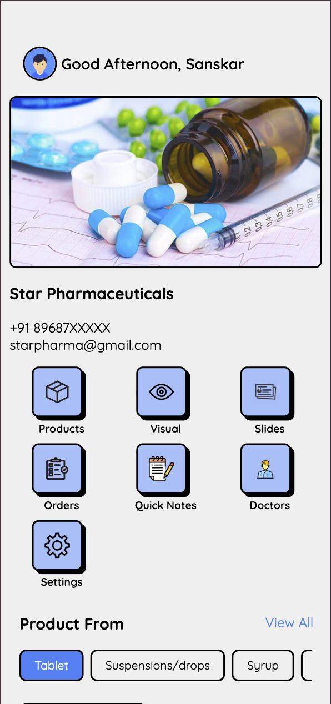
    

    
Main Dashboard

  

  

    

      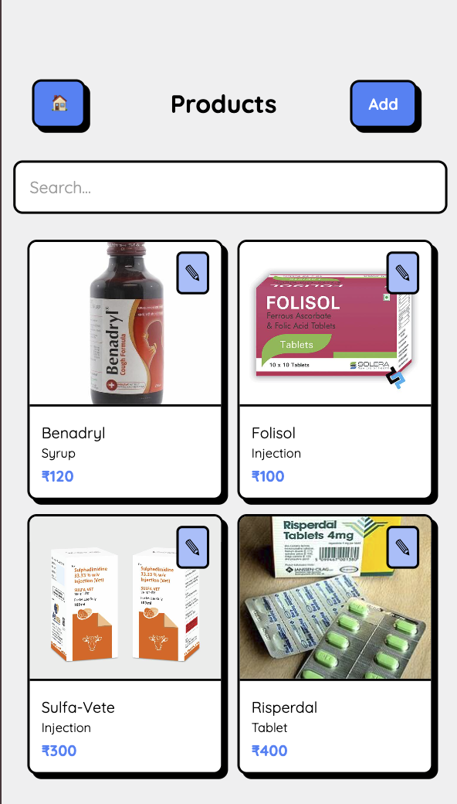
    

    
Products List

  

  

    

      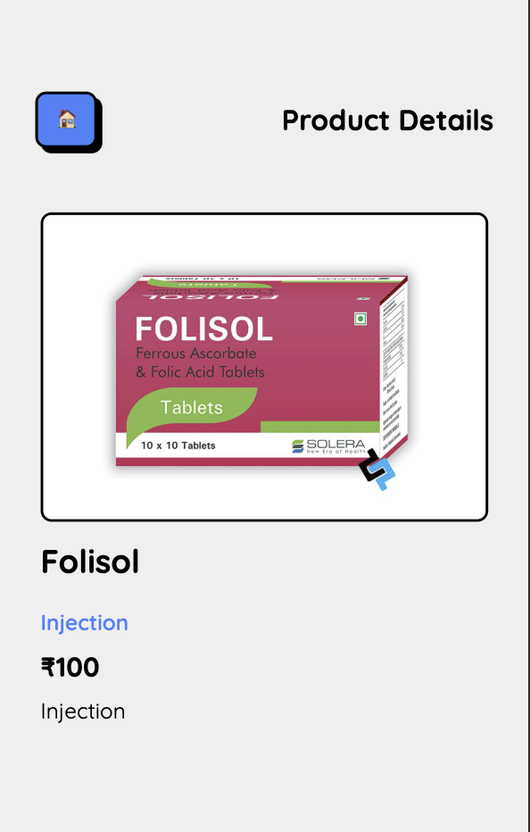
    

    
Product Detail

  

  

    

      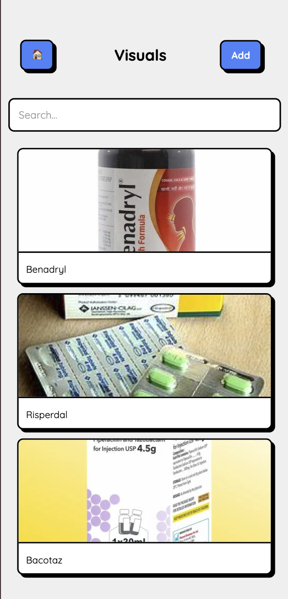
    

    
Visual Aids Selection

  

  

    

      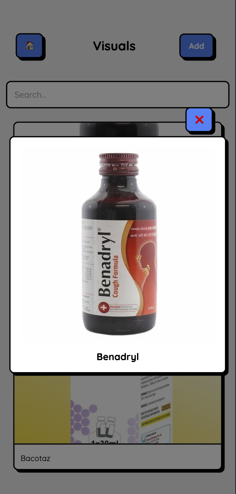
    

    
Visual Modal

  

  

    

      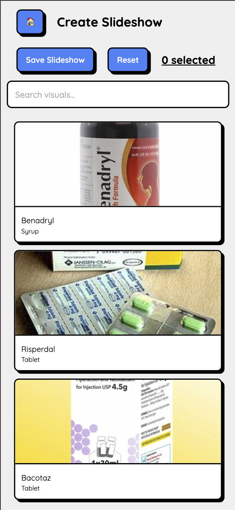
    

    
Slideshow Builder

  

  

    

      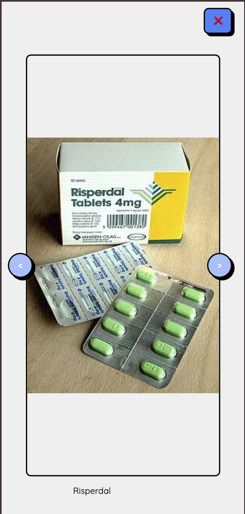
    

    
Fullscreen Slideshow

  

  

    

      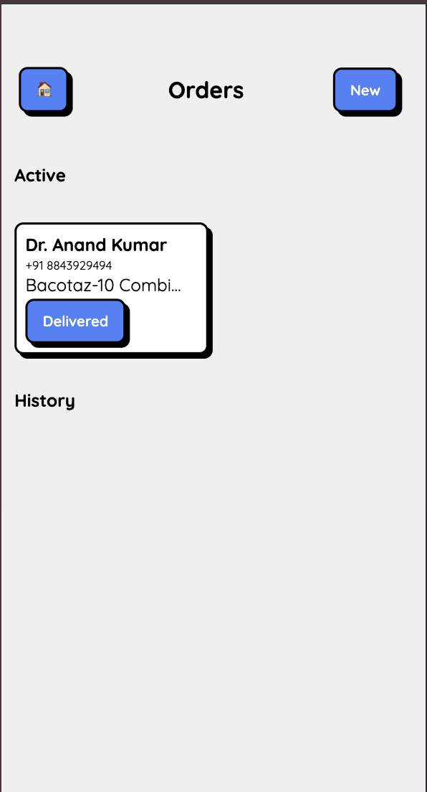
    

    
Orders Screen

  

  

    

      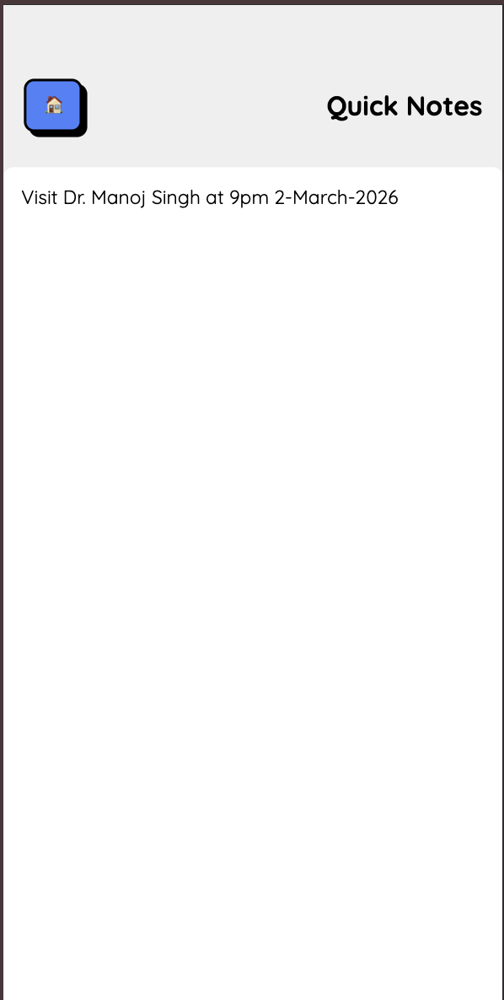
    

    
Quick Notes

  

  

    

      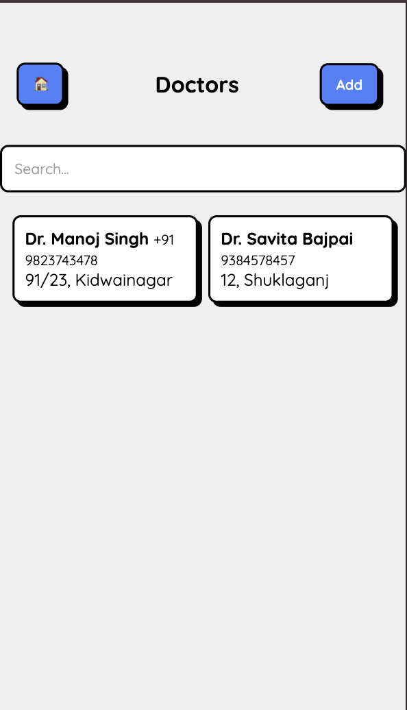
    

    
Doctors List

  

  

    

      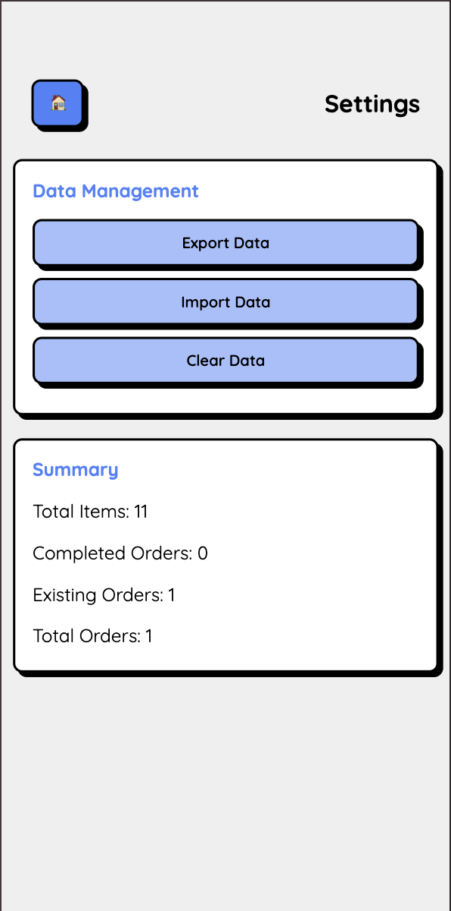
    

    
Settings & Backup

  

    

<!-- Project Overview -->
<h2 style="font-size: 32px; font-weight: 700; margin-bottom: 24px; border-left: 6px solid #4ade80; padding-left: 20px;">🚀 Project Overview</h2>

    Lightweight offline-first CRM built specifically for pharmaceutical field sales representatives.

    

        
✅

        
Simplicity

    

    

        
🔒

        
Reliability

    

    

        
💾

        
Data Safety

    

    

        
📱

        
Mobile First

    

    

        
🧩

        
Low Complexity

    

<!-- Architecture -->
<h2 style="font-size: 32px; font-weight: 700; margin: 80px 0 32px 0; border-left: 6px solid #4ade80; padding-left: 20px;">🏗 Architecture Overview</h2>

    <h3 style="font-size: 24px; font-weight: 600; margin-bottom: 16px; display: flex; align-items: center; gap: 12px;">
        1️⃣ Frontend Layer
    </h3>
    

        <ul style="margin: 0; padding-left: 8px; list-style: none;">
            <li style="margin-bottom: 12px; display: flex; align-items: center; gap: 12px;">✅ Vanilla JavaScript (ES Modules)</li>
            <li style="margin-bottom: 12px; display: flex; align-items: center; gap: 12px;">✅ HTML5 + Modular CSS</li>
            <li style="margin-bottom: 12px; display: flex; align-items: center; gap: 12px;">✅ Mobile-first Responsive Design</li>
            <li style="color: #f87171;">❌ No frameworks • Zero bloat</li>
        </ul>
    

    <h3 style="font-size: 24px; font-weight: 600; margin-bottom: 16px; display: flex; align-items: center; gap: 12px;">
        2️⃣ Local Database Layer
    </h3>
    

        
Dexie.js + IndexedDB

        <pre style="background: #0f172a; padding: 24px; border-radius: 12px; overflow-x: auto; font-size: 15px; line-height: 1.5; color: #94a3b8; border: 1px solid #27272a;"><code>
    db.version(1).stores({
    products: "++id,name,category,price,image,description,visualAid",
    visuals: "++id,name,category,image",
    slideshows: "++id,name,*visualIds",
    orders: "++id,name,phone,address,goods,done,timestamp,deliveryTimestamp",
    notes: "id,text",
    doctors: "++id,name,phone,area,timestamp,remark"
    });
</code></pre>
        

    

<!-- Features -->
<h2 style="font-size: 32px; font-weight: 700; margin: 80px 0 40px 0; border-left: 6px solid #4ade80; padding-left: 20px;">📦 Features</h2>

    

        

            <h3 style="font-size: 22px; font-weight: 700; margin-bottom: 16px; display: flex; align-items: center; gap: 12px;">🧾 Products</h3>
            <ul style="padding-left: 20px; font-size: 17px; color: #d1d5db;">
                <li style="margin-bottom: 8px;">Add / Edit / Delete with images</li>
                <li style="margin-bottom: 8px;">Category, Price, Description</li>
                <li>Visual Aid linking</li>
            </ul>
        

        

            <h3 style="font-size: 22px; font-weight: 700; margin-bottom: 16px; display: flex; align-items: center; gap: 12px;">🎞 Slideshows</h3>
            <ul style="padding-left: 20px; font-size: 17px; color: #d1d5db;">
                <li style="margin-bottom: 8px;">Fullscreen presentation</li>
                <li style="margin-bottom: 8px;">Smooth fade animation</li>
                <li>Manual navigation</li>
            </ul>
        

    

    

        

            <h3 style="font-size: 22px; font-weight: 700; margin-bottom: 16px; display: flex; align-items: center; gap: 12px;">📦 Orders</h3>
            <ul style="padding-left: 20px; font-size: 17px; color: #d1d5db;">
                <li style="margin-bottom: 8px;">Active + History view</li>
                <li style="margin-bottom: 8px;">Mark as Delivered</li>
                <li>Timestamp tracking</li>
            </ul>
        

        

            <h3 style="font-size: 22px; font-weight: 700; margin-bottom: 16px; display: flex; align-items: center; gap: 12px;">⚙️ Settings</h3>
            <ul style="padding-left: 20px; font-size: 17px; color: #d1d5db;">
                <li style="margin-bottom: 8px;">Full JSON Export / Import</li>
                <li style="margin-bottom: 8px;">Safe database reset</li>
                <li>Future cloud sync ready</li>
            </ul>
        

    

<!-- Tech Stack -->
<h2 style="font-size: 32px; font-weight: 700; margin: 80px 0 32px 0; border-left: 6px solid #4ade80; padding-left: 20px;">🧰 Technologies Used</h2>

    <table style="width: 100%; border-collapse: collapse; font-size: 17px;">
        <thead>
            <tr style="border-bottom: 2px solid #27272a;">
                <th style="text-align: left; padding: 16px 0; color: #a3a3a3; font-weight: 500;">Layer</th>
                <th style="text-align: left; padding: 16px 0; color: #a3a3a3; font-weight: 500;">Technology</th>
            </tr>
        </thead>
        <tbody>
            <tr style="border-bottom: 1px solid #27272a;"><td style="padding: 18px 0;">Database</td><td style="padding: 18px 0; font-weight: 600;">Dexie.js</td></tr>
            <tr style="border-bottom: 1px solid #27272a;"><td style="padding: 18px 0;">Storage</td><td style="padding: 18px 0; font-weight: 600;">IndexedDB</td></tr>
            <tr style="border-bottom: 1px solid #27272a;"><td style="padding: 18px 0;">UI</td><td style="padding: 18px 0; font-weight: 600;">Vanilla JS + HTML + CSS</td></tr>
            <tr style="border-bottom: 1px solid #27272a;"><td style="padding: 18px 0;">Mobile Wrapper</td><td style="padding: 18px 0; font-weight: 600;">Capacitor</td></tr>
            <tr style="border-bottom: 1px solid #27272a;"><td style="padding: 18px 0;">Android Build</td><td style="padding: 18px 0; font-weight: 600;">Android Studio</td></tr>
            <tr style="border-bottom: 1px solid #27272a;"><td style="padding: 18px 0;">Search</td><td style="padding: 18px 0; font-weight: 600;">Fuse.js</td></tr>
            <tr><td style="padding: 18px 0;">Image Processing</td><td style="padding: 18px 0; font-weight: 600;">Canvas API</td></tr>
        </tbody>
    </table>

<!-- Footer -->

    
✍ Built by <strong style="color: #4ade80;">Sankalp</strong>

    
Practical offline-first CRM for pharmaceutical field management

    
License: Private Use • Personal Tool

